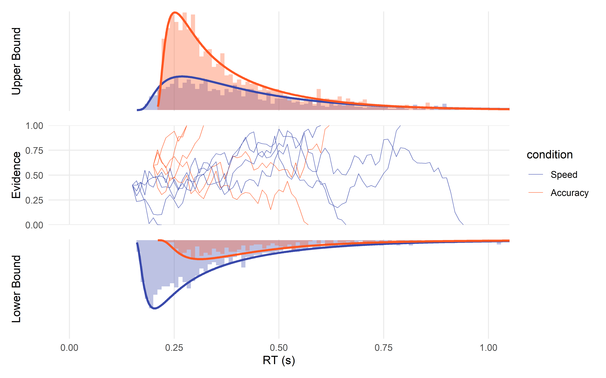
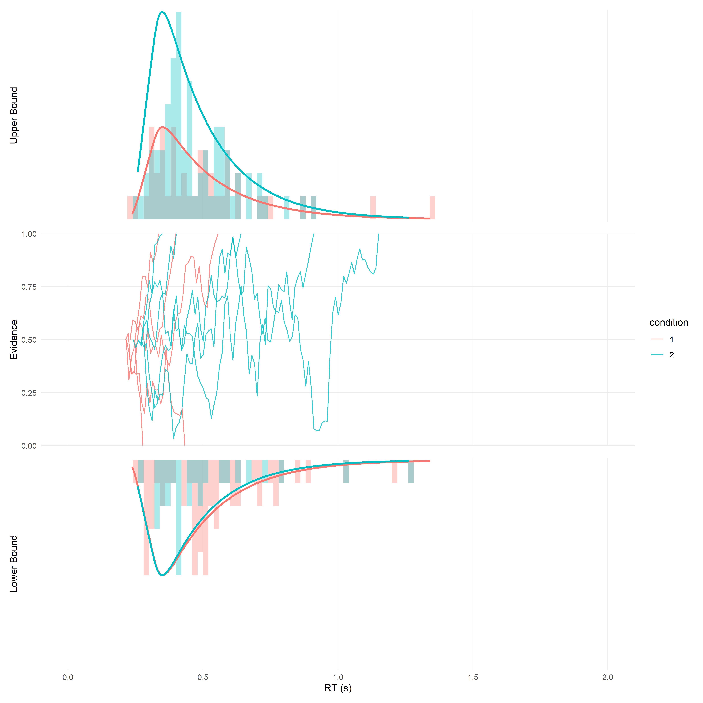

# easyRT

*Tools and examples for modelling Reaction Times in R*

**\[WORK IN PROGRESS\]**

<!-- -->

## Motivation

This repo started as my attempt at understanding and implementing
sequential models, starting with (Hierarchical) Drift Diffusion Models
(DDMs) for reaction times in R. **Please don’t hesitate** to open an
issue to discuss and suggest things that could be improved or clarified.

## Content

Reaction time (RTs) have been traditionally modelled using traditional
linear models (e.g., ANOVAs). However, it is problematic because RTs are
**not** normally distributed. A popular mitigation method is to
**transform** the data (e.g., by log-transform), but it is **not a good
idea** ([Schramm & Rouder,
2019](https://doi.org/10.31234/osf.io/9ksa6)). Instead, one should use
statistical models that **describe** or **generate** RT-like data.

You should start by reading:

- [**Lindelov’s overview of RT
  models**](https://lindeloev.github.io/shiny-rt/): An absolute
  must-read.
- [**De Boeck & Jeon
  (2019)**](https://www.frontiersin.org/articles/10.3389/fpsyg.2019.00102/full):
  A paper providing an overview of RT models.

This repository contain the following vignettes:

- [**Drift Diffusion Model (DDM) in R: A
  Tutorial**](https://dominiquemakowski.github.io/easyRT/articles/ddm.html)
- [**Ex-Gaussian models in R: A
  Tutorial**](https://dominiquemakowski.github.io/easyRT/articles/exgaussian.html)

*Note: these are work-in-progress. Please get in touch if you want to
contribute and help, it’s a good way of learning.*

## Installation

``` r
remotes::install_github("DominiqueMakowski/easyRT")

library(easyRT)
```

## What does this package do?

Not much. It is mostly about its vignettes, but it also has some
convenience functions to generate and plot drift diffusion models. We’ll
see how it evolves over time.

``` r
sim <- ddm_data(drift = c(0, 1), bs = 1, bias = 0.5, ndt = 0.2)

ddm_plot(sim)
```

<!-- -->
