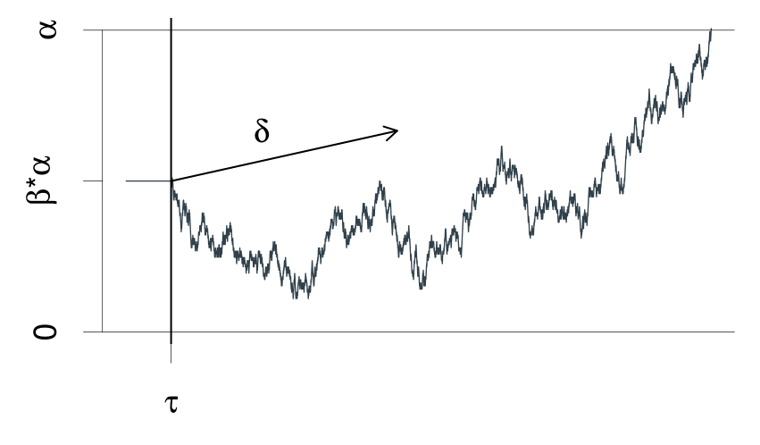

```{r message=FALSE, warning=FALSE, include=FALSE}
set.seed(111)
```

## Setup

If you haven't, install the **easyRT** package by running:

```{r eval=FALSE}
remotes::install_github("DominiqueMakowski/easyRT")
```

Load the necessary packages.

```{r warning=FALSE, message=FALSE}
library(tidyverse)
library(easystats)
library(patchwork)
library(brms)
library(easyRT)
```


## Acknowledgments 

DDMs appear to be quite complicated to implement. I tried to use *HDDM* and *PyDDM* in Python, and had a look at R alternatives, but I didn't find any solution that was easy to use and flexible enough (for my use-case) out-of-the-box. It seems like the powerful *brms* is currently the best way to approach that, though it has a steep learning curve... Thus, a massive thanks to @singmann, that made [this blogpost](http://singmann.org/wiener-model-analysis-with-brms-part-i/), the [rtdists](https://github.com/rtdists/rtdists/) and [fddm](https://github.com/rtdists/fddm) packages.

## Theory

```{r echo=FALSE, fig.cap="*A graphical illustration of the Wiener diffusion model for two-choice reaction times. An evidence counter starts at value $\\alpha*\\beta$ and evolves with random increments. The mean increment is $\\delta$ . The process terminates as soon as the accrued evidence exceeds $\\alpha$ or deceeds 0. The decision process starts at time $\\tau$ from the stimulus presentation and terminates at the reaction time. This figure is from Wabersich and Vandekerckhove (2014).*", message=FALSE, warning=FALSE}

```

Drift Diffusion Models, aka Diffusion Decision Model, aka DDMs are a class of **sequential models** that model RT as a drifting process towards a response. They are useful to jointly model reaction time and a binary outcome, such as 2 different choices or accuracy (i.e., "correct" vs "error"). They are based on Wiener distributions that are defined by 4 parameters:

- **drift**: The **drift** rate (delta $\delta$) is the average slope of the accumulation process towards the boundaries. The larger the (absolute value of the) drift rate, the more effective the evidence accumulation for the corresponding response option. A drift rate close to 0 suggests an ambiguous stimulus. Typical range: [-5, 5].
- **bs**: The **boundary separation** threshold (alpha $\alpha$) is the distance between the two decision bounds and interpreted as a measure of response caution (i.e., of speed-accuracy trade-off, with high *bs* being related to high accuracy). It represents the amount of evidence that is needed to make a response. Typical range: [0.5, 2]. 
- **bias**: Initial bias (beta $\beta$) for any of the responses. The starting point of the accumulation process. Typical range: [0.3, 0.7].
- **ndt**: The **non-decision time** (tau $\tau$) captures all non-decisional process, such as stimulus encoding, motor processes, etc. Typical range: [0.1, 0.5] s.

Additional variability parameters can include:

- **ndt_var**: Also called `st0`. Typical range: [0, 0.2] s.

## Simple Example

In this example, we are going to simulate data for 4 conditions with *known* parameters, and we will investigate how we can then model and recover these parameters.

### Data

```{r warning=FALSE, message=FALSE}
sim <- ddm_data(n = c(200, 200, 200, 200),
                drift = c(-1, 0, 1, 2),
                bs = 1,
                bias = c(0.4, 0.5, 0.6, 0.7),
                ndt = 0.2)

ddm_plot(sim)
```

- Condition 1: $drift~\delta = -1,~bias~\beta = 0.4$
- Condition 2: $drift~\delta = 0,~bias~\beta = 0.5$
- Condition 3: $drift~\delta = 1,~bias~\beta = 0.6$
- Condition 4: $drift~\delta = 2,~bias~\beta = 0.7$

Boundary separation *bs* and *ndt* have been fixed to 1 and 0.15 for all conditions. Let's visualize the raw data and the theoretical distribution it comes from.


```{r warning=FALSE, message=FALSE}
df <- sim$data
head(df)
```

### FDDM


```{r warning=FALSE, message=FALSE, eval=FALSE}
model <- fddm::ddm(rt + response ~ condition, data = df)
summary(model)
```

Unfortunately, `fdmm` doesn't seem to work and throws the following error:

```
Error in nlminb(start = init, objective = objective, gradient = gradient,  :
  NA/NaN gradient evaluation
```


### Formula

Let's start with modelling only the drift rate.

```{r warning=FALSE, message=FALSE}
formula <- bf(rt | dec(response) ~ 0 + condition)

family <- wiener(link_bs = "identity",
                 link_ndt = "identity",
                 link_bias = "identity")
```

@singmaann [gives this](http://singmann.org/wiener-model-analysis-with-brms-part-i/) rationale for setting an `identity` link:

> *Because the drift rate can take on any value (i.e., from -Inf to Inf), the default link function is "identity" (i.e., no transformation) which we retain. The other three parameters all have a restricted range. The boundary needs to be larger than 0, the non-decision time needs to be larger than 0 and smaller than the smallest RT, and the starting point needs to be between 0 and 1. The default link-functions respect these constraints and use "log" for the first two parameters and "logit" for the bias. This certainly is a possibility, but has a number of drawbacks leading me to use the "identity" link function for all parameters. First, when parameters are transformed, the priors need to be specified on the untransformed scale. Second, the individual-levels deviations (i.e., the random-effects estimates) are assumed to come from a multivariate normal distribution. Parameters transformations would entail that these individual-deviations are only normally distributed on the untransformed scale. Likewise, the correlations of parameter deviations across parameters would also be on the untransformed scale. Both make the interpretation of the random-effects difficult.*

> *When specifying the parameters without transformation (i.e., link = "identity") care must be taken that the priors places most mass on values inside the allowed range. Likewise, starting values need to be inside the allowed range. Using the identity link function also comes with drawbacks discussed at the end. However, as long as parameter outside the allowed range only occur rarely, such a model can converge successfully and it makes the interpretation easier.*


### Priors

- **b**: Our priors on the effect of conditions on the drift rate are centred around 0 and give enough probability mass to plausible values (the typical range for drift being [-5, 5]). A student distribution has fatter tails than a Gaussian one, dealing better with outliers (a Cauchy distribution would also be a good alternative). 
- **ndt**: Our priors on the non-decision time is a *gamma* distribution, that naturally excludes 0. We set it slightly skewed to the left, so that most of the mass covers the 0 - 0.5 s (we don't expect non-decision processes to take more than 0.5 s). Note that we have to specify the upper bound (ub) as empty to overwrite the default value.
- **bs**: Our priors on the boundary separation is a wider *gamma* distribution (excluding 0), with a likelihood peaking around 1.
- **bias**: Our priors is a *beta* distribution (naturally bounded at $]0, 1[$) centered around 0.5.


```{r warning=FALSE, message=FALSE}
# get_prior(formula, data = df, family = family)
prior <- c(
  prior("student_t(3, 0, 2)", class = "b"),
  set_prior("gamma(1.5, 3)", class = "ndt", ub = "min_Y"),
  set_prior("gamma(3, 2)", class = "bs"),
  set_prior("beta(1.3, 1.3)", class = "bias")
) |>  brms::validate_prior(formula,
                           family = family,
                           data = df)

prior_data <- brms:::prepare_print_prior(prior) |> 
  mutate(ub = ifelse(ub == "min_Y", min(df$rt), ub),
         Parameter = ifelse(coef != "", paste0(class, "_", coef), class)
    ) |> 
  filter(Parameter != "b") |> 
  ggdist::parse_dist()  


prior_data |> 
  ggplot(aes(y = Parameter, xdist = .dist_obj)) +
  ggdist::stat_halfeye(geom = "slab", n = 10001, normalize="xy") +
  # geom_vline(xintercept = 0.3) +
  scale_x_continuous(breaks = scales::pretty_breaks(n = 10)) +
  coord_cartesian(xlim = c(-5, 5)) + 
  labs(title = "Priors") + 
  theme_minimal()
```


### Sampling

```{r warning=FALSE, message=FALSE, results='hide'}
init_func <- function(chain_id=1) {
  list(bias = 0.5, bs = 1 , ndt = 0.2, b = rep(0, 4))
}

# str(m$fit@inits)


m <- brm(formula,
         data = df,
         family = family,
         prior = prior,
         algorithm = "sampling",
         init = init_func)
         
         # # If using `algorithm = "fullrank"`, add the following:
         # iter = 10000, # N of convergence iterations, defaults to 2000.
         # output_samples = 4000, # N of posterior samples to draw and save, defaults to 1000.
         # elbo_samples = 100, # N of samples for Monte Carlo estimate of ELBO (objective function), defaults to 100.
         # tol_rel_obj = 0.01, # convergence tolerance on the relative norm of the objective, defaults to 0.01.
         # importance_resampling = TRUE # adjust the draws at the optimum to be more like draws from the posterior distribution
```


```{r warning=FALSE, message=FALSE}
m

as.data.frame(m) |> 
  select(starts_with("b_"), bs, ndt, bias) |> 
  datawizard::data_to_long(names_to="Parameter", rows_to = "iter") |> 
  ggplot(aes(y = Parameter)) +
  ggdist::stat_halfeye(data = prior_data, aes(xdist = .dist_obj), geom = "slab", n = 10001, normalize="xy") +
  # ggdist::stat_dotsinterval(aes(x = value, fill = Parameter), color = "black", slab_linewidth = NA, scale = 1, dotsize = 2, normalize = "xy") +
  ggdist::stat_slabinterval(aes(x = value, fill = Parameter), slab_linewidth = NA, scale = 1, normalize = "xy") +
  geom_vline(xintercept = 0, linetype = "dashed") + 
  coord_cartesian(xlim = c(-2.5, 5)) +
  theme_minimal()
```

### Posterior Predictive Check

```{r warning=FALSE, message=FALSE}
brms::pp_check(m)
# performance::check_predictions(m)

df$Predicted <- as.numeric(get_predicted(m, predict = "prediction", iterations = 100))
# posterior_predict(m, newdata=df, draws = 10)

ddm_plot(mutate(df, rt = Predicted), density = sim$density) 
```

*Note: I am not sure why the predictions (gotten with `get_predicted()`) are so off...*


## Better Model


### Formula

```{r warning=FALSE, message=FALSE}
df$condition <- as.numeric(df$condition) - 1

formula <- bf(rt | dec(response) ~ 0 + Intercept + condition,
              bias ~ 0 + Intercept + condition)

family <- wiener(link_bs = "identity",
                 link_ndt = "identity",
                 link_bias = "identity")
```


### Priors


```{r warning=FALSE, message=FALSE}
# get_prior(formula, data = df, family = family)
prior <- c(
  prior("student_t(3, 0, 1)", class = "b", coef="condition", dpar = ""),
  set_prior("student_t(3, 0, 1)", class = "b", coef="Intercept", dpar = ""),
  set_prior("student_t(3, 0, 0.05)", class = "b", coef="condition", dpar = "bias"),
  set_prior("normal(0.5, 0.15)", class = "b", coef = "Intercept", dpar = "bias"),
  set_prior("gamma(1.5, 3)", class = "ndt", ub = "min_Y"),
  set_prior("gamma(3, 2)", class = "bs")
) |>  brms::validate_prior(formula,
                           family = family,
                           data = df)


prior_data <- brms:::prepare_print_prior(prior) |> 
  filter(prior != "(flat)") |> 
  mutate(ub = ifelse(ub == "min_Y", min(df$rt), ub),
         Parameter = paste0(
           ifelse(coef != "", paste0(class, "_", coef), class), 
           ifelse(dpar != "", paste0("_", dpar), ""))
    ) |> 
  ggdist::parse_dist()  


prior_data |> 
  ggplot(aes(y = Parameter, xdist = .dist_obj)) +
  ggdist::stat_halfeye(geom = "slab", n = 10001, normalize="xy") +
  # geom_vline(xintercept = 0.3) +
  scale_x_continuous(breaks = scales::pretty_breaks(n = 10)) +
  coord_cartesian(xlim = c(-5, 5)) + 
  labs(title = "Priors") + 
  theme_minimal()
```

### Sampling

```{r message=FALSE, warning=FALSE, results='hide'}
# stancode(m)
init_func <- function(chain_id=1) {
  list(b = rep(0, 2),
       b_bias = c(0.5, 0),
       bs = 1, ndt = 0.2)
}

# m$fit@inits

m <- brm(formula,
         data = df,
         family = family,
         prior = prior,
         algorithm = "sampling",
         init = init_func)
         
         # # If using `algorithm = "fullrank"`, add the following:
         # iter = 10000, # N of convergence iterations, defaults to 2000.
         # output_samples = 4000, # N of posterior samples to draw and save, defaults to 1000.
         # elbo_samples = 100, # N of samples for Monte Carlo estimate of ELBO (objective function), defaults to 100.
         # tol_rel_obj = 0.01, # convergence tolerance on the relative norm of the objective, defaults to 0.01.
         # importance_resampling = TRUE # adjust the draws at the optimum to be more like draws from the posterior distribution
```

```{r warning=FALSE, message=FALSE}
m

as.data.frame(m) |> 
  select(b_condition_bias = b_bias_condition, b_Intercept_bias = b_bias_Intercept, b_condition, b_Intercept, bs, ndt) |> 
  datawizard::data_to_long(names_to="Parameter", rows_to = "iter") |> 
  ggplot(aes(y = Parameter)) +
  ggdist::stat_halfeye(data = prior_data, aes(xdist = .dist_obj), geom = "slab", n = 10001, normalize="xy") +
  # ggdist::stat_dotsinterval(aes(x = value, fill = Parameter), color = "black", slab_linewidth = NA, scale = 1, dotsize = 2, normalize = "xy") +
  ggdist::stat_slabinterval(aes(x = value, fill = Parameter), slab_linewidth = NA, scale = 1, normalize = "xy") +
  geom_vline(xintercept = 0, linetype = "dashed") + 
  coord_cartesian(xlim = c(-2.5, 5)) +
  theme_minimal()
```


### Posterior Predictive Check

```{r warning=FALSE, message=FALSE}
brms::pp_check(m)
# performance::check_predictions(m)

df$Predicted <- as.numeric(get_predicted(m, predict = "prediction", iterations = 100))
# posterior_predict(m, newdata=df, draws = 10)

ddm_plot(mutate(df, rt = Predicted, condition = as.factor(condition)), density = sim$density) 
```


